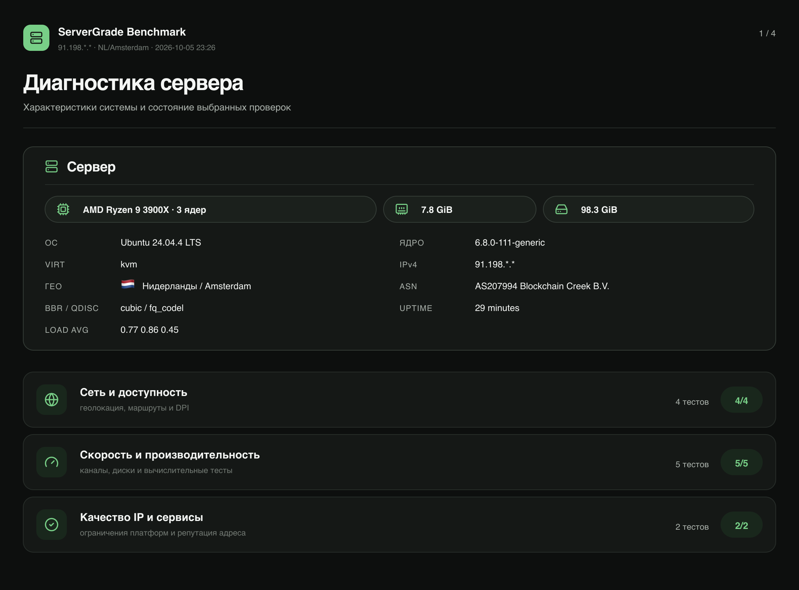
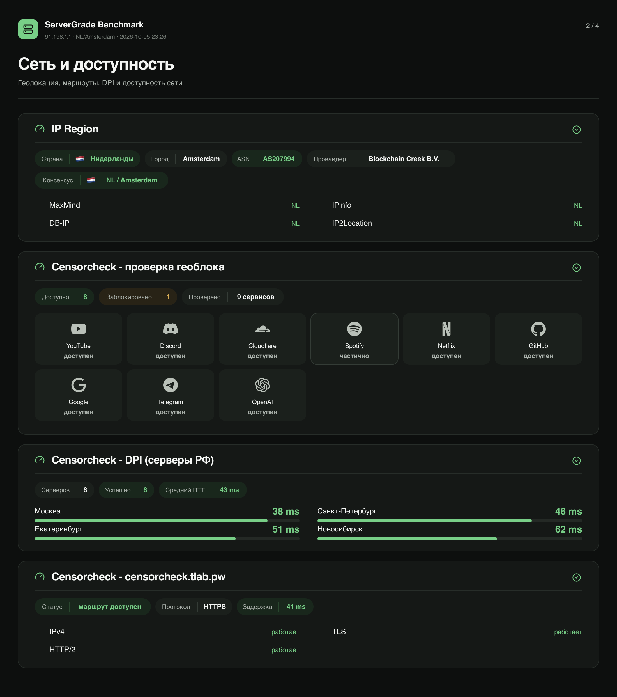
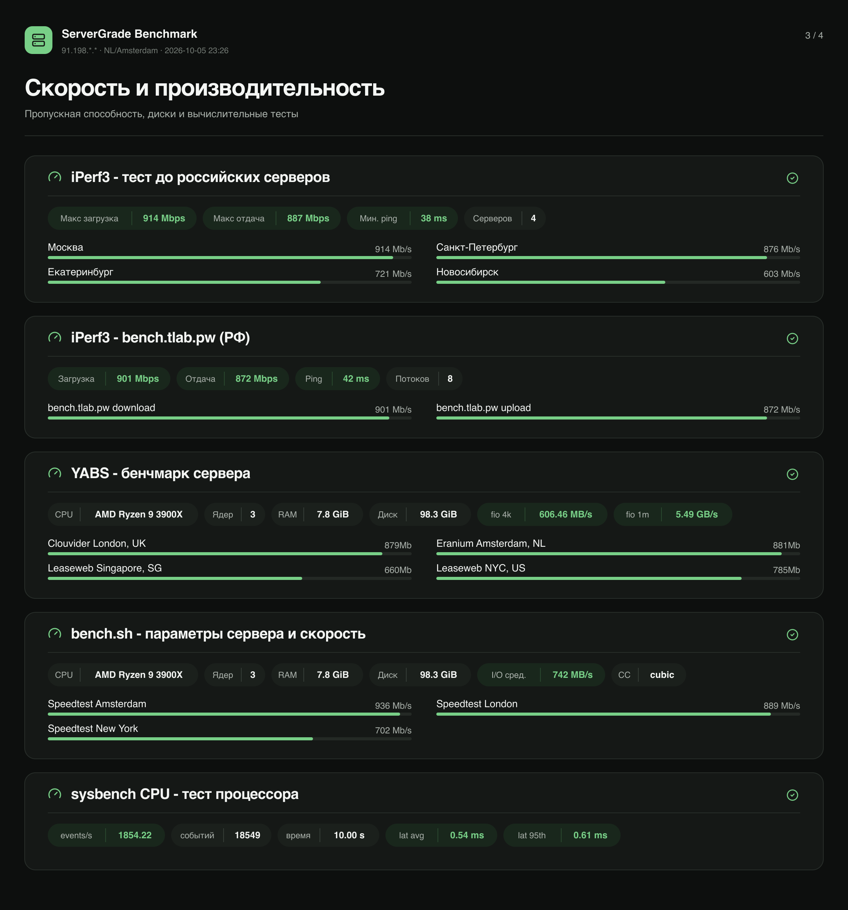
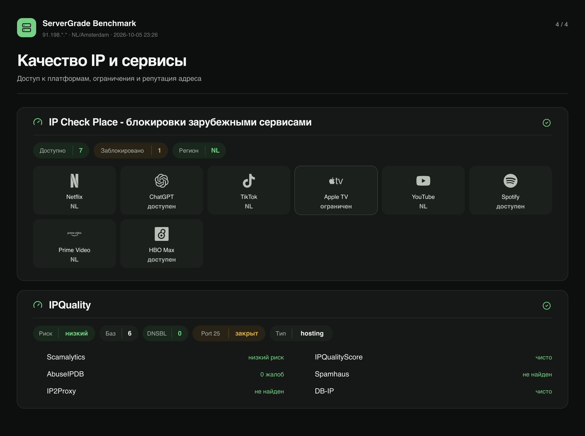

# ServerGrade

Минималистичный тест сервера с аккуратными карточками результатов. Проверяет железо, сеть, производительность, доступность сервисов и качество IP, а затем собирает готовые PNG/SVG-отчёты.



## Что проверяет

- конфигурацию CPU, RAM и диска;
- геолокацию IP с названием страны и флагом;
- маршруты, задержку, потери пакетов и скорость сети;
- CPU, память и дисковую подсистему;
- доступность стриминговых, AI- и инфраструктурных сервисов;
- репутацию IP и результаты CensorCheck с наглядным пингом.
- итоговый ServerGrade Score по шкале 0–100 с отдельными оценками сети,
  производительности и качества IP.

## Как считается оценка

`ServerGrade Score v1.0` использует веса: сеть — 30%, производительность —
45%, качество IP и доступность сервисов — 25%. Числовые результаты оцениваются
по опубликованным в скрипте порогам, а состояния проверок — по единой шкале:
успех 100, предупреждение 55, ошибка/блокировка 10. Сначала усредняются сигналы
одного теста, затем тесты категории — большое количество проверенных сервисов
не может искусственно перевесить CPU, диск или сеть.

Оценка помечается как **полная**, только когда выполнен весь стандартный набор
без пропусков и ошибок. Во всех остальных случаях она явно называется
предварительной и показывает процент покрытия. Это не позволяет получить
высокий подтверждённый балл, запустив только удобные тесты.

## Быстрый запуск

```bash
bash <(curl -fsSL https://raw.githubusercontent.com/kapybarovv/servergrade/main/servergrade.sh)
```

Или установить как команду:

```bash
curl -fsSL https://raw.githubusercontent.com/kapybarovv/servergrade/main/servergrade.sh -o /tmp/servergrade.sh
sudo bash /tmp/servergrade.sh --install
servergrade
```

Поддерживаются Debian/Ubuntu, AlmaLinux/Rocky/CentOS, Fedora, Alpine и Arch Linux. Для части тестов нужны `curl`, `awk`, `sed`, `grep` и права root.

## Формат отчёта

По умолчанию результаты разбиваются на четыре согласованные страницы:

1. обзор сервера;
2. сеть и маршруты;
3. производительность;
4. качество IP и доступность сервисов.

Режим можно поменять переменной окружения:

```bash
MT_ALBUM=2 servergrade  # четыре страницы по категориям, по умолчанию
MT_ALBUM=1 servergrade  # отдельная карточка для каждого теста
MT_ALBUM=0 servergrade  # один длинный отчёт
```

## Примеры страниц

| Обзор | Сеть |
| --- | --- |
|  |  |

| Производительность | Качество IP |
| --- | --- |
|  |  |

Дизайн использует Montserrat для акцентной типографики, Manrope для интерфейса и Lucide-подобную линейную иконографику. Скрипт старается установить недостающие шрифты только для генерации отчёта и сохраняет SVG рядом с PNG.

> Скриншоты в репозитории — демонстрация дизайна и структуры отчёта на примере конфигурации сервера. Они не являются криптографически подтверждённым или актуальным публичным бенчмарком конкретного хоста.

## Приватность

В публичных карточках IP маскируется. Перед публикацией отчёта всё равно проверьте его содержимое: сторонние тесты могут вернуть имя провайдера, ASN, геолокацию или другие сведения об инфраструктуре.

## Платформа результатов

Проектирование публичных страниц тестов, рейтинга провайдеров и защиты от
подделки описано в [docs/platform-architecture.md](docs/platform-architecture.md).

Минимальная реализация публичных пользовательских страниц находится в
[`platform/`](platform/). После её развёртывания скрипт публикует сводку так:

```bash
SERVERGRADE_PUBLISH_URL=https://servergra.de/api/results servergrade
```

Каждая страница явно предупреждает, что результат прислал пользователь, данные
могут быть изменены, а использовать их следует на свой риск.

## Лицензия

Проект развивается как самостоятельная переработка диагностического скрипта multitest. Перед коммерческим распространением проверьте лицензии подключаемых тестов, наборов иконок и внешних источников данных.
