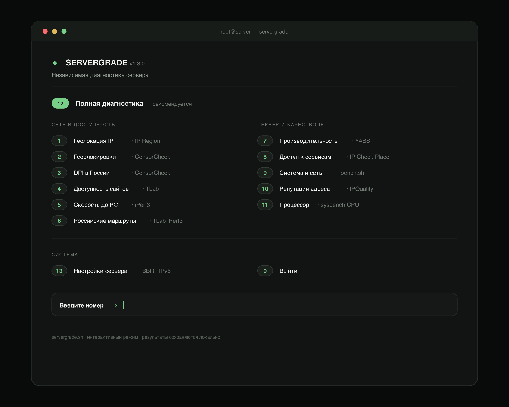
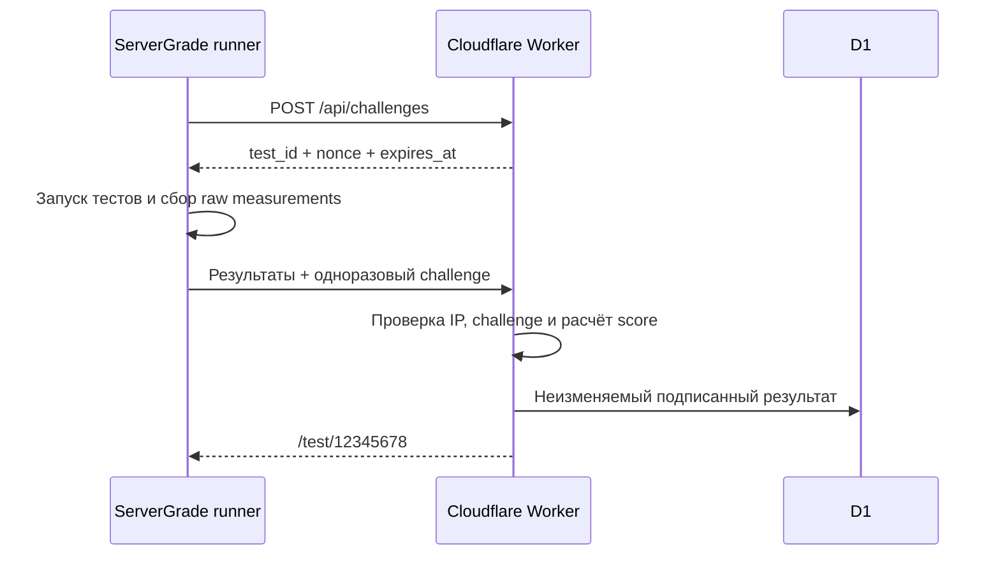

<div align="center">

# ServerGrade

### Один запуск. Полная картина сервера. Публичный отчёт.

Технический бенчмарк Linux-серверов: железо, сеть, производительность,
качество IP и доступность сервисов — в терминале, на изображениях и на одной
публичной странице.

[](https://servergrade-results.kapybarovv.workers.dev/)
[](https://github.com/kapybarovv/servergrade)

```bash
bash <(curl -fsSL https://raw.githubusercontent.com/kapybarovv/servergrade/main/servergrade.sh)
```

**Скопируйте команду → вставьте в терминал сервера → получите ссылку на отчёт.**

[Сайт](https://servergrade-results.kapybarovv.workers.dev/) ·
[Пример отчёта](https://servergrade-results.kapybarovv.workers.dev/test/83426476) ·
[Архитектура платформы](docs/platform-architecture.md) ·
[Исходный проект](https://github.com/saveksme/multitest)

</div>

---


## Что происходит после запуска

```text
┌──────────────────┐      ┌──────────────────┐      ┌──────────────────┐
│  Linux-сервер    │      │  ServerGrade     │      │  Публичный отчёт│
│  VPS / Dedicated │ ───▶ │  runner          │ ───▶ │  /test/12345678 │
└──────────────────┘      └──────────────────┘      └──────────────────┘
        │                          │                          │
        │ характеристики          │ raw-измерения            ├─ изображения
        │ сеть и маршруты          │ терминальный вывод       ├─ полные данные
        │ CPU / RAM / диск         │ серверный score          └─ terminal log
        │ качество IP              │ подпись результата
        └──────────────────────────┴─────────────────────────────────────
```

Во время выполнения ServerGrade не прячет исходные тесты: их результаты
появляются в терминале по мере готовности. В финале выводится короткая ссылка на
страницу замера.

## Не просто ещё один `bench.sh`

| Возможность | Что получает пользователь |
| --- | --- |
| **Инвентаризация сервера** | CPU, ядра, RAM, DDR2–DDR5, накопитель, модель диска, DMI-вендор, ОС, ядро и виртуализация |
| **Сеть** | IPv4/IPv6, ASN, геолокация, маршруты, задержка, потери и пропускная способность |
| **Производительность** | CPU, память и дисковая подсистема с нормализованными метриками |
| **Качество IP** | Репутация адреса, CensorCheck, DPI и доступность популярных сервисов |
| **Рейтинг 0–100** | Отдельные оценки сети, производительности, качества IP и итоговый балл |
| **Три представления** | Изображения, структурированная страница и сохранённый терминальный отчёт |
| **Публичная платформа** | Поиск по замерам, фильтры, страницы тестов и ссылки, которыми удобно делиться |

## Отчёт, который не стыдно отправить

| Обзор сервера | Сеть и доступность |
| :---: | :---: |
|  |  |

| Производительность | Качество IP |
| :---: | :---: |
|  |  |

<details>
<summary><strong>Посмотреть терминальное меню</strong></summary>

<br>



</details>

Карточки генерируются одновременно в PNG и SVG. В оформлении используются
Montserrat, Manrope, компактная техническая сетка, линейные иконки и флаги
стран. Публичный IP на изображениях маскируется.

> [!NOTE]
> Скриншоты демонстрируют дизайн и структуру отчёта. Они не являются актуальным
> или криптографически подтверждённым замером конкретного сервера.

## Рейтинг ServerGrade

Итоговая оценка строится не из присланного клиентом числа. Runner передаёт
измерения, а Worker рассчитывает категории самостоятельно.

```text
                  SERVERGRADE SCORE v1.0

  Сеть                         30%  ────────────────┐
  Производительность           45%  ────────────────┼──▶  0…100
  Качество IP и доступность    25%  ────────────────┘
```

Успешная проверка получает `100`, предупреждение — `55`, ошибка или блокировка
— `10`. Сначала усредняются сигналы внутри теста, затем тесты одной категории.
Поэтому десятки лёгких проверок сервисов не могут перевесить слабый CPU, диск
или сеть.

Оценка считается полной только при выполнении стандартного набора. Если часть
проверок пропущена или завершилась ошибкой, отчёт показывает процент покрытия.

## Запуск и установка

### Запуск без установки

```bash
bash <(curl -fsSL https://raw.githubusercontent.com/kapybarovv/servergrade/main/servergrade.sh)
```

### Установка команды `servergrade`

```bash
curl -fsSL https://raw.githubusercontent.com/kapybarovv/servergrade/main/servergrade.sh -o /tmp/servergrade.sh
sudo bash /tmp/servergrade.sh --install
servergrade
```

### Запуск без публикации

```bash
SERVERGRADE_PUBLISH=0 servergrade
```

Поддерживаются Debian/Ubuntu, AlmaLinux/Rocky/CentOS, Fedora, Alpine и Arch
Linux. Недостающие зависимости для выбранных тестов устанавливаются
автоматически. Для установки пакетов и некоторых системных проверок нужны права
`root`.

<details>
<summary><strong>Режимы генерации изображений</strong></summary>

```bash
MT_ALBUM=2 servergrade  # четыре страницы по категориям — по умолчанию
MT_ALBUM=1 servergrade  # отдельная карточка для каждого теста
MT_ALBUM=0 servergrade  # один длинный отчёт
```

</details>

## Верификация результатов

ServerGrade разделяет удобство публикации и уровень доверия к результату.

| Статус | Что означает |
| --- | --- |
| **Верифицировано** | Запуск получил одноразовый challenge, привязан к исходному IP, score рассчитан Worker, результат подписан и после публикации не изменяется |
| **Не проверено** | Результат опубликован совместимым или старым клиентом без полного набора подтверждений |
| **Проверяется** | Runner начал замер, но финальный результат ещё не загружен |

Поток подтверждённого запуска:



> [!IMPORTANT]
> Даже подтверждённый синтетический тест не заменяет нагрузочное тестирование
> вашего приложения. Сравнивайте серверы в одинаковых условиях и учитывайте
> соседей по ноде, тарифные лимиты и время проведения замера.

## Приватность

- публичные карточки маскируют IP;
- геолокация, ASN и провайдер нужны для интерпретации сетевых результатов;
- сторонние тесты могут вернуть дополнительные сведения об инфраструктуре;
- перед публикацией чувствительного отчёта проверьте его содержимое;
- публикацию можно отключить через `SERVERGRADE_PUBLISH=0`.

## Платформа результатов

В [`platform/`](platform/) находится SaaS-часть проекта: Cloudflare Worker,
D1-схема, публичный каталог и страницы отчётов. Подробная модель данных,
challenge flow, подписи и варианты бесплатной инфраструктуры описаны в
[`docs/platform-architecture.md`](docs/platform-architecture.md).

```text
platform/
├── src/index.js             Worker API + HTML-интерфейс
├── src/tailwind.css         исходные стили
├── src/tailwind.generated.css
├── schema.sql               схема Cloudflare D1
└── wrangler.jsonc           конфигурация развёртывания
```

## Происхождение и благодарность

ServerGrade создан как форк и глубокая переработка проекта
**[saveksme/multitest](https://github.com/saveksme/multitest)** — интерактивного
скрипта диагностики и тестирования Linux-серверов.

Огромная благодарность **[@saveksme](https://github.com/saveksme)** за исходную
идею, структуру мультитеста и большую работу по объединению серверных проверок в
одном удобном runner. Без оригинального `multitest` этот проект бы не появился.

В ServerGrade поверх исходной идеи были переработаны визуальный язык отчётов,
терминальный интерфейс, система оценки, публичная платформа, публикация
результатов и модель верификации.

> Если ServerGrade оказался полезен, поставьте звезду и
> [оригинальному multitest](https://github.com/saveksme/multitest).

## Лицензии и внешние проекты

ServerGrade запускает и агрегирует несколько независимых диагностических
инструментов. Перед коммерческим распространением проверьте лицензии скрипта,
подключаемых тестов, шрифтов, иконок и внешних источников данных.

---

<div align="center">

**Проверить сервер — одна команда.**

[Запустить тест](https://servergrade-results.kapybarovv.workers.dev/) ·
[Поставить звезду](https://github.com/kapybarovv/servergrade) ·
[Открыть multitest](https://github.com/saveksme/multitest)

</div>
